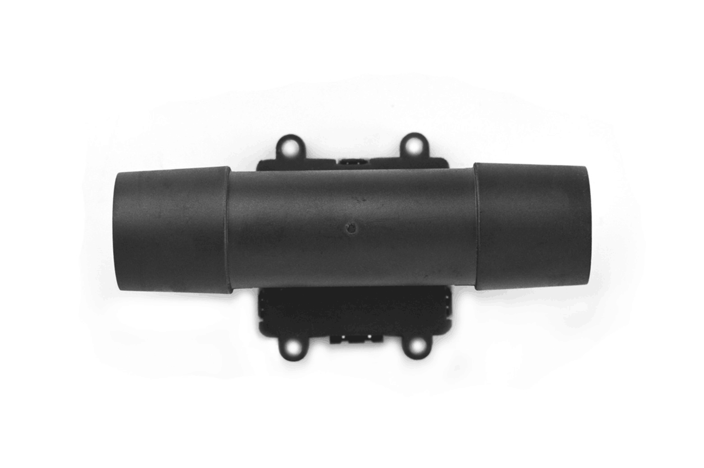

# DFRobot_FRN20

- [中文版](./README_CN.md)

## Overview
The FRn20 series micro-flow gas mass flow sensor is specifically designed for various micro-flow process control applications. This product is an upgrade based on the FR20 series, offering significantly enhanced zero stability and full-scale signal stability. It is suitable for industrial process monitoring.   

## Product Link (https://www.dfrobot.com/)

```text
SKU: SEN0630
```

## Table of Contents
* [Summary](#summary)
* [Installation](#installation)
* [Methods](#methods)
* [Compatibility](#compatibility)
* [History](#history)
* [Credits](#credits)

## Summary
This Python library provides drivers for the FRN20 flow sensor on Raspberry Pi, offering I2C communication, parameter loading and flow data reading interfaces for easy integration.

## Installation
1. Clone the repository to your Raspberry Pi:
```bash
git clone https://github.com/DFRobot/DFRobot_FRN20.git
```

2. Enter the Python directory:
```bash
cd DFRobot_FRN20/python/raspberrypi
```

3. Install dependencies:
```bash
pip install smbus2
```
4. For example, to run the getSensorData.py example, you need to enter:
```bash
python getSensorData.py
```

## Methods

```python
def begin(self):
    """
    Initialize the sensor and ensure parameters are loaded (blocking until success)
    @return Initialization status
    @retval 1: Success
    @retval -1: Failure (I2C init error)
    """

def read_mass_flow_data(self):
    """
    Read mass flow data from the sensor (automatically converted to physical units)
    @return Operation result
    @retval 1: Success
    @retval 0: Failure
    @note The mass flow data is stored in self.mass_flow_data (in SLM - Standard Liters per Minute)
    """
```

## Compatibility
| Platform | Work Well | Work Wrong | Untested | Remarks |
|----------|:---------:|:----------:|:--------:|---------|
| Raspberry Pi 2 |  | | √ | |
| Raspberry Pi 3 |  | | √ | |
| Raspberry Pi 4 | √ | | | |

## History
- 2026/01/26 - Version 1.0.0 released.

## Credits
Written by PLELES (PLELES@dfrobot.com),2026.(Welcome to our [website](https://www.dfrobot.com/))
